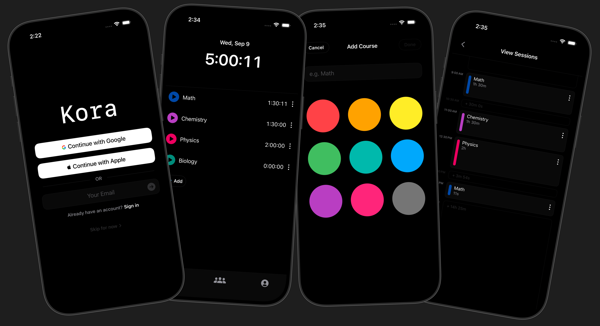

<h1 align="center">
    Kora
</h1>
<p align="center">
    A native iOS study tracker built with SwiftUI. Tracks study sessions per course, grouped by days (5AM-4:59AM), and shows the history as a monthly heatmap and a daily timeline. Runs fully offline as a guest, accounts are currently optional.
</p>

<div align="center">
    
</div>

## Technical Stack

### Core Frameworks

- **SwiftUI** - Every view, no storyboards
- **SwiftData** - Local persistence for courses and sessions
- **Observation** - `@Observable` for reactive state, no Combine
- **AuthenticationServices** - Sign in with Apple via `SignInWithAppleButton`
- **CryptoKit** - SHA-256 nonce hashing for the Apple and Google ID token flows
- **UIKit** - `UIApplicationDelegateAdaptor` for orientation locking, `UIImpactFeedbackGenerator` for drag haptics

### Dependencies

- **supabase-swift** - Authentication and the `profiles` table
- **GoogleSignIn-iOS** - Google ID token retrieval

### Architecture

- **MVVM pattern** with the `@Observable` macro
- **Coordinator pattern** for the splash, login, onboarding, and main state machine
- **Service layer** for timing, auth, and profile access
- **Local first**: SwiftData is the source of truth. Supabase backs identity only, not study data

### Key Components

**ViewModels:**

- `HomeViewModel` - Owns the `TimerEngine`, reloads today's per-course totals on launch, schedules the day rollover timer
- `HeatmapViewModel` - Month scoped session queries mapped to daily totals and per-day session blocks
- `AuthViewModel` - Apple, Google, email code, and password flows. Owns the nonce lifecycle and error copy
- `OnboardingViewModel` - Username normalization, validation, and availability checks

**Services:**

- `TimerEngine` - Timing state machine with no persistence. Emits finished sessions through an `onSessionEnd` closure
- `SupabaseAuthService` - ID token sign-in, email OTP, password set and sign-in, nonce and SHA-256 helpers
- `SupabaseProfileService` - Profile fetch and create, case-insensitive username availability

**Models:**

- `Course` - SwiftData model with name, colour, sort order, and owning `userId`
- `StudySession` - SwiftData model with course id, start and end, and a copy of the course name and colour

**Components:**

- `ReorderableList` - Drag to reorder built on `DragGesture`, with callbacks passed through the environment
- `KoraAsteriskShape` - The five armed logo drawn as a `Shape`
- `HeatmapGrid`, `DailyTimeline`, `TimeField`, `CourseRow`

## Features

### Session Timing

- Tap a course to start it. Tap the running course to stop it and start a break. Tap a different course to switch with no break recorded
- Elapsed time comes from `ProcessInfo.processInfo.systemUptime`, which is monotonic, so timezone changes and manual clock edits cannot corrupt a running session
- Breaks over one hour are dropped instead of recorded, so leaving for the evening reads as a new session rather than a six hour break
- Sessions are written on stop through `TimerEngine.onSessionEnd`, which keeps the timer free of any SwiftData dependency

### Study Day

- A day runs 5:00 AM to 4:59 AM, so a 1 AM session counts toward the night it belongs to instead of rolling over at midnight
- `Calendar.studyDaySplit(start:end:)` splits a session that crosses the boundary into per-day segments for totals and the heatmap
- If the boundary passes mid-session, `rollToNewDay(boundary:)` closes the session at 5 AM and opens a new one without interrupting the live counter

### Heatmap and Timeline

- Month grid with seven shades, bucketed at 1, 2, 3, 4, 6, and 8 hours
- Tapping a day expands a `DailyTimeline` under the grid
- The daily sheet interleaves session blocks with empty gap blocks, sized by duration, and opens scrolled to the last session
- Sessions can be edited or deleted. Times are entered through a custom segmented `TimeField` instead of a system picker

### Courses

- Nine hue, five shade palette
- Drag to reorder with haptics on pickup and on each swap. Order persists in `sortOrder`
- Long press opens a context menu that blurs the other rows

### Accounts

- Sign in with Apple, Google, an emailed code, or email and password
- Guest mode is local only, with no account and no network
- Guest rows have a `nil` owner. The first account to sign in claims every unowned course and session
- Username is chosen in an onboarding step with live availability checking

## Design Decisions

### Data and Sync

- **Supabase over CloudKit**: CloudKit's private database cannot support cross-user features, and shared group leaderboards are the end goal
- **No anonymous account for guests**: an anonymous Supabase user only survives delete and reinstall on the same device. With no credential to sign back in with it is unrecoverable from a new phone, which is not worth anon-aware RLS and server side row reassignment
- **Sessions store a copy of the course name and colour**: deleting a course orphans its sessions instead of cascading, so heatmap history survives

### Authentication

- **Log in and Sign up are separate**: Supabase returns a decoy user for `signUp` against a taken email to prevent enumeration, so intent has to be asked for rather than inferred
- **Username is the identity**: Apple returns a display name only on the first authorization and may give a private relay email, so nothing can rely on reading it later
- **Login is a gate that can be skipped**, shown only when there is no valid session. Skipping writes the app's one `UserDefaults` flag

### Timing

- **Monotonic clock, not wall clock**: `systemUptime` for elapsed time, `Date` only for the timestamps written to storage
- **`TimerEngine` holds no context**: it emits `(courseId, start, end)` and `HomeViewModel` decides what to save, which keeps the timing rules testable on their own

## Project Structure

```
Kora/
├── App/              # Entry point, coordinator, Supabase config
├── Models/
│   ├── SwiftData/    # Course, StudySession
│   ├── Domain/       # UserProfile
│   └── Mapping/      # Domain and DTO mappers (stubs)
├── Data/
│   ├── Local/        # Local stores (stubs)
│   ├── Remote/       # Supabase auth, profiles
│   └── Repositories/ # Repository layer (stubs)
├── Services/         # TimerEngine
├── ViewModels/       # Home, Heatmap, Auth, Onboarding
├── Views/
│   ├── Pages/        # Full screens
│   ├── Sheets/       # Modal presentations
│   └── Components/   # Reusable UI
├── Utilities/        # StudyDay, TimeFormatter, TimeEntry, ColorHex
└── Resources/        # Assets
```

## Roadmap

The repo has empty stubs marking work that is planned but not started:

- **Cloud sync**: `SyncEngine`, the repository layer, local stores, and the mappers. Schema and push first, then pull and conflict resolution
- **Study groups**: `GroupsView`, `GroupDetailView`, `JoinGroupSheet`, and the group cache models, for shared leaderboards
- **Focus control**: `FocusControl` and `FocusAppsPickerSheet`, to restrict distracting apps during a session
- **Settings and themes**: `SettingsView`, `ThemeService`, `Theme`

## Known Limitations

- No cloud sync yet, so signing in on a second device starts empty
- The 5 AM boundary resolves against the device timezone, so crossing timezones mid-session can shift which day a session lands on
- Apple and Google sign-in need a real bundle id and provider setup. Neither works against an unconfigured Supabase project
